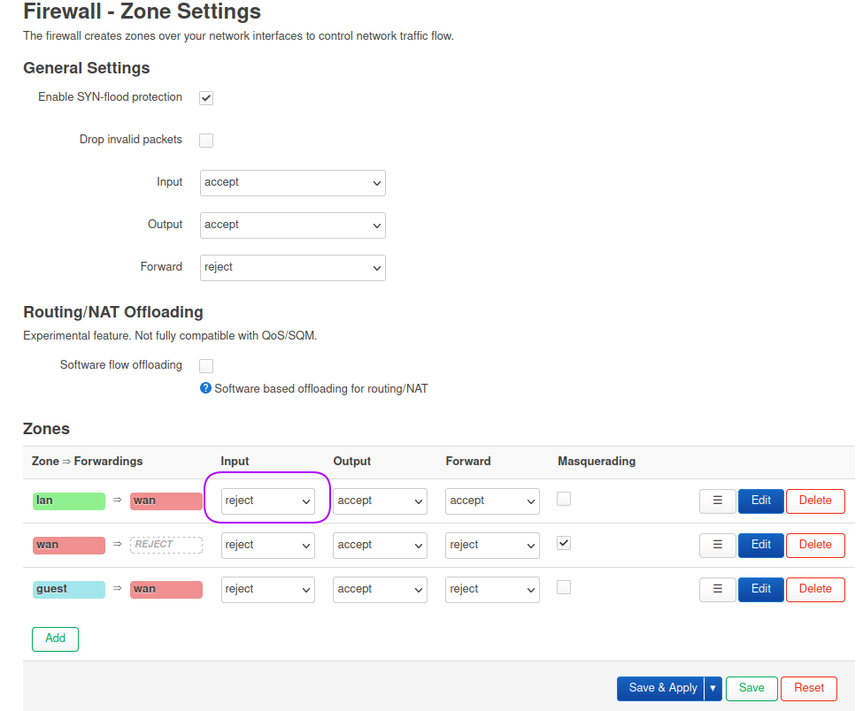
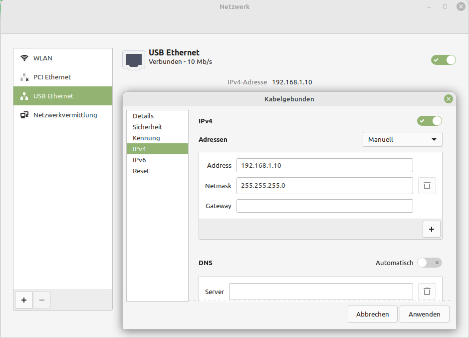
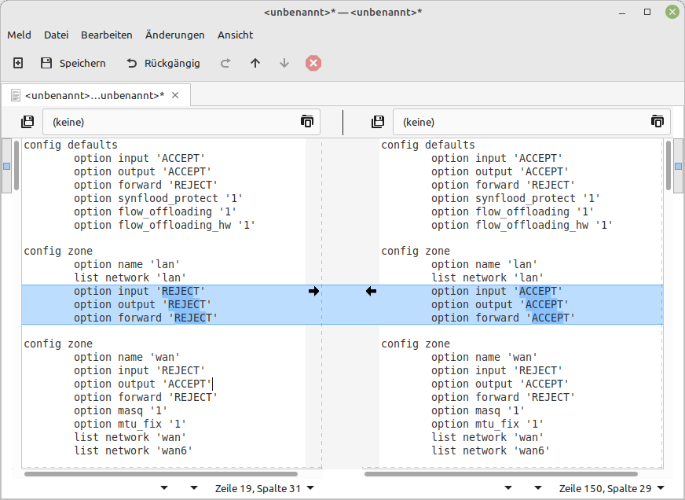

+++
author = "Martin Strohmayer"
title = "OpenWRT Failsave / Widerherstellung"
date = "2023-07-09"
description = ""
featured = true
tags = [
    "OpenWRT"
]
categories = [
    "Hardware"
]
image = "images/OpenWRT_Wrong_Firewall_Setting.png"
thumbnail = "images/OpenWRT_Wrong_Firewall_Setting.png"
+++

Wenn man sich auf einem OpenWrt Router sich selbst ausgesperrt hat, kann man mit dem Failsave-Modus Korrekturen vornehmen. 
<!--more-->





Eine kleine Unachtsamkeit bei den Einstellungen und schon kann man sich selbst aus dem Router aussperren. In dem Fall muss man in den Failsave-Modus des Routers gehen und die Einstellung zurücksetzen.

## Failsave-Modus

Nach dem Einschalten blinkt die Power LED langsam (ca. 2 Hz). In diesem Moment muss man eine Taste am Router gedrückt halten. 
Wenn der Failsave-Modus aktiviert wurde, blinkt die LED sehr schnell (10 Hz). Beim normalen Hochfahren blinkt sie etwas schneller als zuvor und wechselt später auf grün bzw. durchgängiges leuchten.

Der Router hat nun die fixe IP-Adresse 192.168.1.1 und der DHC-Server ist ausgeschaltet.  Man kann sich nur mit einer fixen IP-Adresse per LAN mit ihm verbinden.  
In meinen Fall hab ich mir für einen USB-Ethernet Adapter entschieden um möglichst nichts an den bestehenden Einstellungen verändern zu müssen. Diesen Adapter habe die fixe IPv4 Adresse 192.168.1.10 zugewiesen.




## Fehler korrigieren

Nun kann man sich per SSH-Client als Benutzer root ohne Passwort verbinden. Dann muss man das Dateisystem einbinden damit man Änderungen durchführen kann. 

```
ssh root@192.168.1.1
mount_root
```

Nun kann man auf Konfigurationsdaten in /etc/config zugreifen. 
Wir müssen in diesem Fall die Firewall Einstellungen korrigieren. Dazu öffen wir die Datei "etc/config/firewall" mit vi.

```
vi /etc/config/firewall
```




Nach dem Speichern  bzw. ausführen der Korrekturen kann man den Router neu starten.

```
reboot -f
```

Nun sollte der Router wider erreichbar sein.