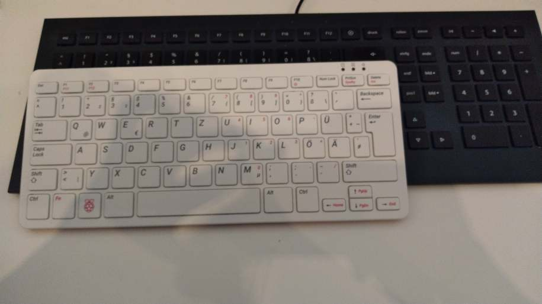
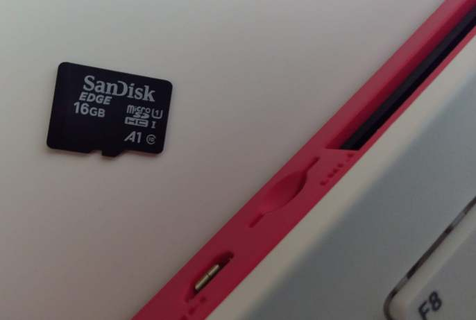
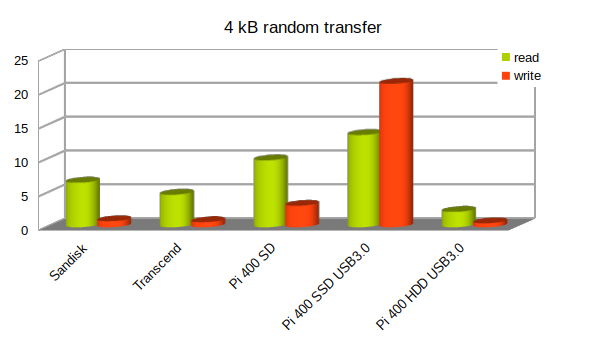
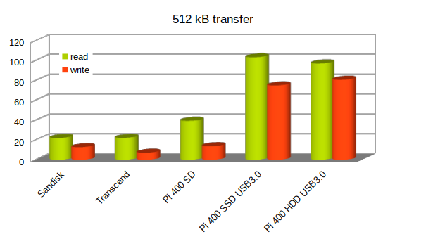
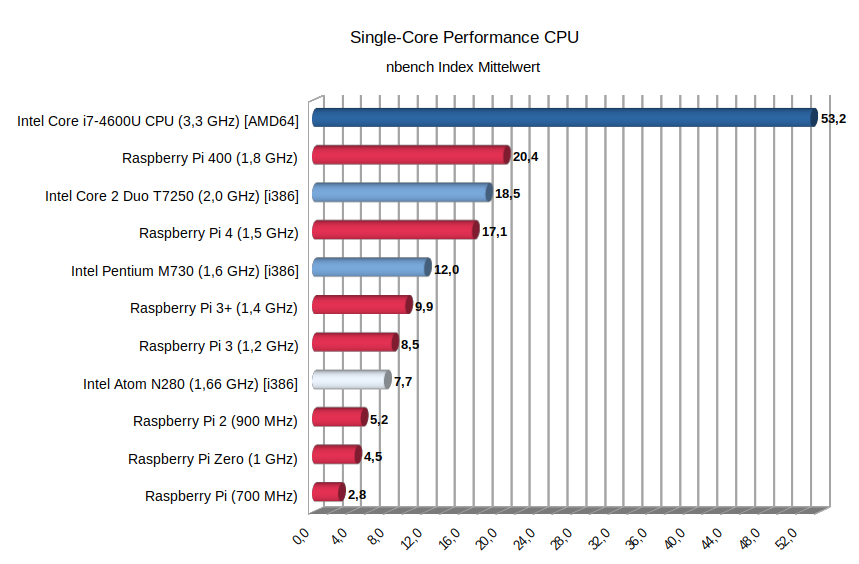
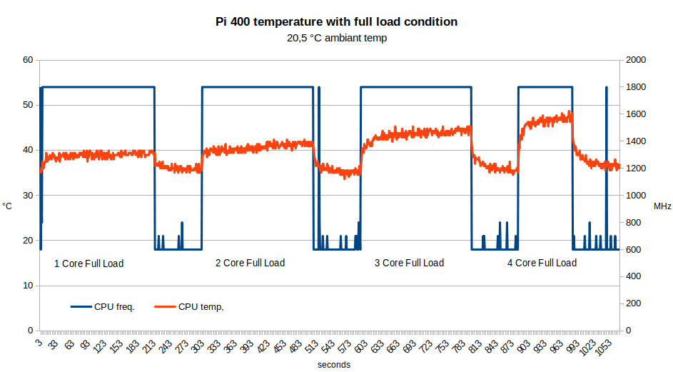
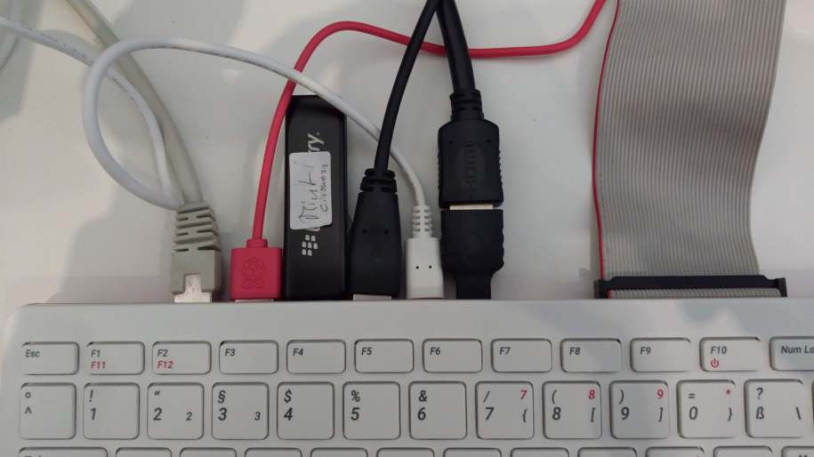
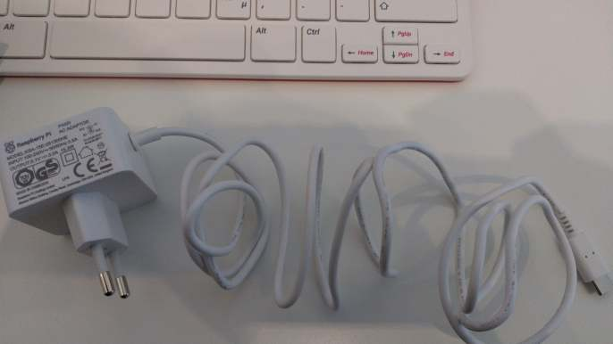

+++
author = "Martin Strohmayer"
title = "Raspberry Pi 400 - Review"
date = "2021-02-04"
description = ""
featured = true
tags = [
    "Raspberry Pi"
]
categories = [
    "Raspberry Pi"
]
image = "images/Pi400.jpg"
thumbnail = "images/Pi400.jpg"
+++

Der neue Raspberry Pi 400 ist eine kompakte Tastatur mit integrierter verbesserter Raspberry Pi 4 Hardware, was sie besser kann, mal sehen ...
<!--more-->

## Beschreibung

Das neueste Produkt der Raspberry Pi (Trading) Ltd. ist eine kompakte Tastatur in der Raspberry Pi 4 Hardware integriert wurde. Es wurde eine verbesserte Version (Revision) des SoC BCM2711 mit der Zusatzbezeichung C0 eingebaut. Die Taktrate wurde also im Vergleich zum Pi 4 mit Revision B0 von 1,5 GHz auf 1,8 GHz erhöht.  Es stehen 4 GB RAM zur Verfügung. Die Anschlüsse sind zum Pi 4 identisch, außer dass ein USB 2.0 Anschluss weniger vorhanden ist. Der Tastatur fehlt im Vergleich zur standard Tastatur der Nummern-Block. Dadurch ist die kompakte Größe möglich.



Angeboten wird der Pi 400 entweder als "nacktes System" also nur die Tastatur oder als Bundle mit Netzteil, Kabeln, Maus, SD-Karte und einer umfangreichen Dokumentation. Achtung einer Bestellung auf das Tastaturlayout achten!

Preis Bundle DE [geizhals.at](https://geizhals.at/raspberry-pi-400-kit-raspberry-pi-400-de-kit-a2414639.html):  100-104 Euro  
Preis Pi400 DE [semaf electronics](https://electronics.semaf.at/Raspberry-Pi-400):  ~78 Euro


## Eckdaten 


**SoC**: Broadcom BCM2711C0 4 x ARM Cortex-A72 (ARMv8) 64-bit mit maximal 1,8 GHz Taktfrequenz  
**GPU**: Broadcom VideoCore VI  
**RAM**: 4GB LPDDR4 SDRAM  
**WLAN**: 2.4 GHz und 5 GHz 802.11b/g/n/ac  
**Bluetooth**: Version 5.0, Bluetooth Low Energy (BLE)  
**LAN**: Gigabit Ethernet  
**GPIO**: 40-pin GPIO header  
**Festspeicher**: microSD-Steckplatz  
**Anschlüsse:**
 * 1x USB Type-C Versorgung
 * 2x micro-HDMI 2.0
 * 1x USB 2.0
 * 2x USB 3.0
 * 1x RJ45 Ethernet
 * 1x Kensington-Schloss
 * 1x 40-Pin GPIO header

**Kühlung**: Interner passiver Kühlkörper  
**Abmessungen**: 29 cm × 12 cm × 2,4 cm   
**Gewicht**: 385 g  

**Bundle Lieferumfang:**

 *  Raspberry Pi 400
 *  Raspberry Pi Maus
 *  Raspberry Pi offizielles Netzteil USB-C
 *  Micro-SD 16 GB
 *  Micro-HDMI auf HDMI-Kabel
 *  Raspberry Pi Beginner Guide


## Test

CNX: [Raspberry Pi 400 Keyboard PC Review and Benchmarks vs Raspberry Pi 4](https://www.cnx-software.com/2020/11/02/raspberry-pi-400-review-benchmarks-vs-raspberry-pi-4/)  
Michael Kofler: [RASPBERRY PI 400](https://kofler.info/raspberry-pi-400/)


Abseits von den vielen Pi 400 Tests die ich gelesen habe, haben mich ein paar technische Dinge interessiert die bisher nicht beleuchtet wurden. Diesen will ich mich nun widmen.

### Lokalisierung

Ich finde es immer etwas Absurd, dass es im Jahre 2021 noch immer nicht möglich ist, ein Tastaturlayout automatisch zu erkennen. Besonders sonderbar ist es, wenn die Tastatur selbst das Computersystem ist, wie bei Pi 400. Nach dem ersten Start wird man vor der Anmeldung gebeten die Lokalisierungeinstellungen zu tätigen. Das passt ganz gut, so kann man das deutsche Layout bereits vor der Passworteingabe setzen. Später kann man dann gleich "raspberry" als Passwort eingeben und nicht wie bei der Raspberry Pi OS Lite Version "raspberrz".  
Allerdings relativiert sich der Eindruck dann gleich wieder, den die Tastatureinstellung gilt nur für die grafische Oberfläche. Wechselt man mit Strg+Alt+F1 auf die Konsole, so ist das englische Layout aktiv. Nun muss man nochmal die Lokalisierungseinstellungen bei Konfigurationstool `` rasp-config`` eingeben, damit alles passt.

### Geschwindigkeit SD-Karte





Da bei Bundle eine SD-Karte dabei ist, fragt man sich wie gut die eigentlich ist und ob eine SSD am USB 3.0 bessere Performancewerte hat. 





Der Test zeigt das die eingesetzte SD-Karte recht schnell ist. 40 MB/s für lesenden Zugriff ist schon ordentlich. Das ist fast doppelt, so hoch als meine bisherige Sandisk Ultra Karte.
Schaut man sich aber die Werte der Samsung 840 Pro SSD am USB an, so spielt diese doch in einer ganz anderen Liga. Besonders die Schreibzugriff liegen um Faktoren höher.  


### CPU 

Der neue Prozessor im SOC taktet nun maximal mit 1,8 statt 1,5 GHz. Also ist die Performance um 20 % erhöht. dazu bedarf es keines Tests. Dennoch interessiert mich der Vergleich zu Intel Prozessoren.



Die Frage ist aber auch, wird die Takterhöhung des neunen Kerns ohne erhöhung der Spannung erreicht? Bzw. kann der Raspberry Pi 4 auch mit 1,8 GHz betrieben werden? 


**Pi 400:**

Bei maximaler CPU-Last und damit Taktrate liegt die CPU-Spannung bei maximal **0,92 V** und im Leerlauf bei 0,8833 V. 

| HW Block: |   ARM   |  Core  |  H264  |    SDRAM   |
|-----------|---------|--------|--------|------------|
| Min Freq: |  600MHz | 250MHz |   0MHz |   3180MHz  |
| Max Freq: | 1800MHz | 500MHz | 500MHz |   3180MHz  |


**Pi 4:**

Beim Pi 4 liegt die CPU-Spannung fix bei bei **0,8875 V**. Die höhere Taktrate des Pi 400 wird also durch Erhöhung der CPI-Spannung erreicht!  

| HW Block: |   ARM   |  Core  |  H264  |    SDRAM   |
|-----------|---------|--------|--------|------------|
| Min Freq: |  600MHz | 250MHz |   0MHz |   3180MHz  |
| Max Freq: | 1500MHz | 500MHz | 500MHz |   3180MHz  |


**Pi 4 overclocked:**

Den Raspberry Pi 4 kann man durch eine Spannungserhöhung mit Faktor 3 (0,075 V) auch stabil auf 1,8 GHz betrieben. Dann läuft er mit **0.9563 V** und damit etwas höher (~0,04 V) als die CPU vom Pi 400.

config.txt:
```
#uncomment to overlock the arm. 1800 MHz is the default.
over_voltage=3
arm_freq=1800
````

Mehr zum Thema Übertakten des Raspberry Pi 4 kannst du bei [How to overclock Raspberry Pi 4](https://magpi.raspberrypi.org/articles/how-to-overclock-raspberry-pi-4) finden.

### Temperatur



Wie der Temperaturaufzeichnung im Vollastbetrieb zeigt, bleibt die CPU-Temperatur immer im grünen Bereich. Die interne passive Kühlung ist optimal ausgelegt.


### WiringPi Library

Die WiringPi Library ist eine weit verbreitete C-Bibliothek für die GPIOs des Raspberry Pis. Sie wurde Ursprünglich von Gordon Henderson programmiert. Er Unterstützt das Projekt inzwischen nicht mehr. Dadurch unterstützt die Library den Raspberry Pi 4 und Pi 400 in der vorinstallieren Version nicht! Bei Veröffentlichung des Pi 4 Computers hat er noch eine allerletzte Version 2.52 auf seiner [Webseite](http://wiringpi.com/wiringpi-updated-to-2-52-for-the-raspberry-pi-4b/) veröffentlicht. Unverständlicherweise ist aber bei Raspberry Pi OS nur die Version 2.50 verfügbar.
Aber auch wenn man die Version 2.52 nachinstalliert, so gibt es keine Erkennung für den Pi 400.

```
gpio version: 2.50
Copyright (c) 2012-2018 Gordon Henderson
This is free software with ABSOLUTELY NO WARRANTY.
For details type: gpio -warranty

Raspberry Pi Details:
  Type: Unknown19, Revision: 00, Memory: 0MB, Maker: Sony 
  * Device tree is enabled.
  *--> Raspberry Pi 400 Rev 1.0
  * This Raspberry Pi supports user-level GPIO access.
```

Zum Glück gibt es aber inzwischen ein Git-Hub [WiringPi](https://github.com/WiringPi/WiringPi) Projekt, das die Library weiter wartet. Hier ist die Version 2.60 verfügbar, die keine Probleme mit der neuen Hardware hat!

```
gpio version: 2.60
Copyright (c) 2012-2018 Gordon Henderson
This is free software with ABSOLUTELY NO WARRANTY.
For details type: gpio -warranty

Raspberry Pi Details:
  Type: Pi 400, Revision: 00, Memory: 4096MB, Maker: Sony 
  * Device tree is enabled.
  *--> Raspberry Pi 400 Rev 1.0
  * This Raspberry Pi supports user-level GPIO access.


+-----+-----+---------+------+---+---Pi 400-+---+------+---------+-----+-----+
 | BCM | wPi |   Name  | Mode | V | Physical | V | Mode | Name    | wPi | BCM |
 +-----+-----+---------+------+---+----++----+---+------+---------+-----+-----+
 |     |     |    3.3v |      |   |  1 || 2  |   |      | 5v      |     |     |
 |   2 |   8 |   SDA.1 |   IN | 1 |  3 || 4  |   |      | 5v      |     |     |
 |   3 |   9 |   SCL.1 |   IN | 1 |  5 || 6  |   |      | 0v      |     |     |
 |   4 |   7 | GPIO. 7 |   IN | 1 |  7 || 8  | 1 | IN   | TxD     | 15  | 14  |
 |     |     |      0v |      |   |  9 || 10 | 1 | IN   | RxD     | 16  | 15  |
 |  17 |   0 | GPIO. 0 |   IN | 0 | 11 || 12 | 0 | IN   | GPIO. 1 | 1   | 18  |
 |  27 |   2 | GPIO. 2 |   IN | 0 | 13 || 14 |   |      | 0v      |     |     |
 |  22 |   3 | GPIO. 3 |   IN | 0 | 15 || 16 | 0 | IN   | GPIO. 4 | 4   | 23  |
 |     |     |    3.3v |      |   | 17 || 18 | 0 | IN   | GPIO. 5 | 5   | 24  |
 |  10 |  12 |    MOSI |   IN | 0 | 19 || 20 |   |      | 0v      |     |     |
 |   9 |  13 |    MISO |   IN | 0 | 21 || 22 | 0 | IN   | GPIO. 6 | 6   | 25  |
 |  11 |  14 |    SCLK |   IN | 0 | 23 || 24 | 1 | IN   | CE0     | 10  | 8   |
 |     |     |      0v |      |   | 25 || 26 | 1 | IN   | CE1     | 11  | 7   |
 |   0 |  30 |   SDA.0 |   IN | 1 | 27 || 28 | 1 | IN   | SCL.0   | 31  | 1   |
 |   5 |  21 | GPIO.21 |   IN | 1 | 29 || 30 |   |      | 0v      |     |     |
 |   6 |  22 | GPIO.22 |   IN | 1 | 31 || 32 | 0 | IN   | GPIO.26 | 26  | 12  |
 |  13 |  23 | GPIO.23 |   IN | 0 | 33 || 34 |   |      | 0v      |     |     |
 |  19 |  24 | GPIO.24 |   IN | 0 | 35 || 36 | 0 | IN   | GPIO.27 | 27  | 16  |
 |  26 |  25 | GPIO.25 |   IN | 0 | 37 || 38 | 0 | IN   | GPIO.28 | 28  | 20  |
 |     |     |      0v |      |   | 39 || 40 | 0 | IN   | GPIO.29 | 29  | 21  |
 +-----+-----+---------+------+---+----++----+---+------+---------+-----+-----+
 | BCM | wPi |   Name  | Mode | V | Physical | V | Mode | Name    | wPi | BCM |
 +-----+-----+---------+------+---+---Pi 400-+---+------+---------+-----+-----+
```

## Fazit 

Der Sinn der Hardware erschließt sich mir kaum. Einen Pi 400 kann man sich mit einem normalen Pi 4 selbst zusammenstellen. Auch die 1,8 GHz können problemlos erreicht werden. Die Raspberry Pi Tastatur bekommt man für 25 Euro (inkl. integriertem USB Hub). Der Raspberry Pi 4 GB kostet ca. 57,5 Euro. Macht zusammen 82,5 Euro statt der 78 für den Pi 400. Mehr Sinn macht da schon das Bundle für ca. 100 Euro immerhin bekommt man dann, ein Netzteil, eine Maus und eine qualitativ hochwertige 16 GB SD-Karte dazu. Nicht zu vergessen auch noch das Handbuch. Da kommt man mit den einzelnen Komponenten schnell darüber.  
Also wenn schon Pi 400 dann als Bundle. Ich würde aber eher davon abraten und auf einen standard Raspberry Pi setzen, mit den Eingabegeräten seiner Wahl. 
So kann man später die Hardware auch mal anders einsetzen als Server oder zur Homeautomation. Eine defekt Tastatur kann dann auch einfach ausgetauscht werden.  

Komplett überzeugend ist das interne passive Kühlsystem. Es führt dazu, dass das System absolut lautlos seinen Dienst verrichtet. Die CPU kommt nie in einen kritischen Temperaturbereich, sodass eine Taktreduzierung gefürchtet werden müsste.  

Was mich wirklich gestört hat, sind die Abstände zwischen den Anschlüssen auf der Hinterseite. Da relativ wenig Platz vorhanden ist, besonders wenn man Adapter für den Micro-HDMI Anschluss einsetzt. Des weiteren sind die Kabeln vom Bundle generell sehr dick und steif.





Ich denke beim Pi 400 wurde auch einiges an Möglichkeiten vertan. Man hätte aus der Hardware so viel mehr machen können. Ein paar Beispiele: 
  * M2-SSD Slot
  * Gesockelter SO-DIMM RAM  
  * Integriertes Display mit Touch Funktion (Touch Bar wie bei Apple MacBook Pro)
  * Integriertes LEDs für einfache GPIO Aufgaben oder angepasster HAT beilegen
  * Mikrofon und Line-in Eingang

Zumindest hätte man intern ein Compute Modul einsetzen können, dann wäre ein Aktualisierung der Hardware möglich gewesen.  
Im übrigen gibt es keinen Display- und Kameraanschluss wie beim Pi 4.  

Naja, ansonsten ist das Produkt aber ganz solide und es macht auch Spaß damit zu arbeiten. Klar die Performance ist weit weg von der eines i7 Intel Laptops von vor 6 Jahren, aber dennoch kann damit durchaus gearbeitet werden. Ich persönlich bleibe aber lieber auf meinem System. 