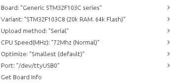
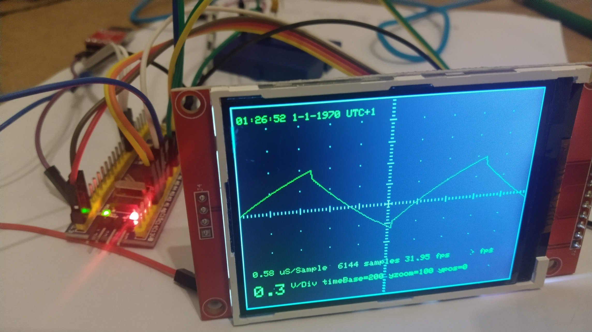

+++
author = "Martin Strohmayer"
title = "STM32-O-Scope das <10 Euro Osilloskop"
date = "2021-01-31"
description = ""
featured = true
tags = [
    "Mikrocontroller",
    "Raspberry Pi",
]
categories = [
    "Elektronik"
]
image = "images/STM32-O-Scope.jpg"
thumbnail = "images/STM32-O-Scope.jpg"
+++

Mit einem günstigen STM32 Mikrocontroller und einen SPI-TFT-Display kann man einfaches Oszilloskop bauen. Hier erfährst du wie das geht...
<!--more-->

## Beschreibung

 Das Projekt [STM32-O-Scope](https://github.com/pingumacpenguin/STM32-O-Scope) von pingumacpenguin macht aus einem günstigen STM32 Mikrocontroller System und einem SPI-TFT-Display ein einfaches Oszilloskop. Das Projekt ist extrem einfach aufgebaut. Leider wird die Firmware aber nur als Source bzw. Arduino IDE Projekt angeboten. Man muss sich also um die Konfiguration der Entwicklungsumgebung, um die Bibliotheken und die Kompilierung und schlussendlich den Flashvorgang selbst kümmern. Hier warten leider viele Hürden, also doch kein Projekt für Anfänger.
Die dazugehörige README und [Wiki-Seite](https://github.com/pingumacpenguin/STM32-O-Scope/wiki) helfen nämlich an den entscheidenden Stellen nicht weiter! 
Eine weiter neuere Anleitung aus 2017 von satoshinm blog [Building an Amazing $10 Oscilloscope with an STM32 blue pill, LCD touchscreen, and STM32-O-Scope software](https://satoshinm.github.io/blog/180105_stm32scope_building_an_amazing_10_oscilloscope_with_an_stm32_blue_pill_lcd_touchscreen_and_stm32-o-scope_software.html) verbessert die Situation. 
Hier ist die Pin-Belegung übersichtlich beschrieben. Aber das Kapitel "Compiling the software" enthält einige Anpassungen aber auch irrefürende Hinweise und führt Schlussendlich auch nicht zur fehlerfreien Kompilierung.  

Aus diesem Grund habe ich mich dazu entschlossen eine möglichst einfache detaillierte Schritt für Schritt Anleitung zu erstellen.

## Komponenten

Man benötigt für das Projekt lediglich:
 * STM32F103C8T6 ARM STM32 Minimum System Development Board Module , China Preis ca. 2 Euro 
 * TFT Display mit ili9341 Chipsatz, 320x240 Auflösung (verfügbar mit 2.2, 2.4 oder 2.8 Zoll Größe ), China Preis 5-8 Euro

[STM32F103](https://www.st.com/en/microcontrollers-microprocessors/stm32f103.html) ist eine Mikrocontroller von STMicrosystems mit einem ARM Cortex-M3 Prozessorkern. Die Taktrate beträgt maximal 72 MHz. Der Code "C8" im Namen bedeutet, dass 64 kByte Flash Speicher (undokumentiert oft auch 128 kByte verfügbar) und 20 kByte SRAM im IC vorhanden sind. 
Die Systemplatine mit diesem IC wird für teilweise unter 2 Euro verkauft. Es wird auch mit dem Namen "blue pill" bezeichnet.  Mehr Informationen über das System findet man auf http://stefanfrings.de/stm32/stm32f1.html#bluepill . Aber Achtung, teilweise werden Nachbauten mit einem Clone IC verkauft. Dieser Chip fängt dann mit einer anderen Bezeichnung, wie "CH32" oder "CS32" an. **Hände weg von diesen Clone Systemen!**

Das Display mit dem ili9341 ist ein weit verbreiteter standard Typ mit SPI-Schnittstelle. Optional wird auch die Touch Funktion des Displays unterstützt. In dieser Anleitung wird sie aber nicht beachtet.

## Anschluss

| STM32  Anschluss | LCD Anschluss | Beschreibung |
|:---|-------|---|
|A0  |D/C 	|Data/Command |
|A1  |CS 	|Chip select|
|A2  |RESET |Reset|
|3.3 |LED 	|Hintergrundbeleuchtung |
|A5  |SCK 	|SPI Takt|
|A6  |SDO(MISO) 	|SPI master input / slave output nur bei Touchfunktion|
|A7  |SDI(MOSI) 	|SPI master output / slave input|
|G 	 |GND 	|Ground|
|3.3 |VCC 	|Versorgung|

Optional könnte man die Hintergrundbeleuchtung auch bei A3 Anschließen, allerdings ist die Stromaufnahme zumeist zu hoch für den Chip Ausgang (in meinen Fall 26 mA). Daher würde ich ihn fix auf 3,3 V legen. Ansonsten sollte man eine FET- oder Transistorschaltung vorsehen, sofern diese nicht im Display vorhanden ist.  

Der Anschluss B0 ist der Analoge Eingang des Oszilloskopes. Achtung der Eingang ist unbeschaltet nur für Spannungen von 0 bis 3,3 V geeignet!  
Am Ausgang B1 wird ein 500 Hz Rechtecksignal ausgegeben, das zu Verifikation verwendet werden kann. Eine Drahtbrücke von B0 zu B1 führt also zu Messen dieses Rechtecksignals. Dies sollte für den ersten Test durchgeführt werden.

## STM32duino Firmware übertragen

Bei den üblichen Anleitungen wird empfohlen STM32duino auf das System aufzuspielen. Das hat den Vorteil, dass ab dann das System direkt über den USB-Anschluss programmiert werden kann. Auf den ersten Blick eine Vorteil, allerdings benötigt die Firmware einen großen Teil vom Speicher und verringert also den nutzbaren Flash-Speicher unseres Programms.  
Bei mir hat das dann nicht funktioniert, ich vermute wegen zu wenig Speicher.

**Das aufspielen der STM32duino Firmware ist also nicht nötig!**


Auch wenn man die Firmware aufspielen möchte, so muss man zumindest bei ersten mal eine andere Möglichkeit zum Flashen benutzen.  
Man kann dies über ein eigenes ST-Link Adapter tun, der über USB an die 4 unteren Kontakte (GND, DCLK, DIO, 3.3) am Modul angeschlossen wird. 
In diesem Fall benutzen wir aber eine USB zu UART Adapter mit 3,3 V. Ich verwende hierzu einen Adapter mit CP2102 Chip der gut unter Linux und Windows unterstützt wird.  
Auf einem Raspberry PI kann direkt der vorhandene UART benutzt werden. In diesem Fall benötigt man gar keine zusätzliche Hardware.


| STM32  Anschluss | UART Adapter / RaspPi(BCM) |	Beschreibung (PC sicht) |
|:---|-------|---|
|A9  |RXD (15) | Receive |
|A10 |TXD (14) |Transmit|
|G   |GND |  Ground|
|3.3 |3V3 | Versorgung|

Achtung wenn das STM32-System über den UART Adapter versorgt wird (3.3 Volt) benötigt man keine weitere Versorgung!

Nun muss man das Übertragungs- bzw Flash-Programm vom Hersteller bereitstellen. Es kann unter https://sourceforge.net/projects/stm32flash/ heruntergeladen werden.
Danach muss es kompiliert und installiert werden. 

```
cd ~
mkdir stm
cd stm
apt get install build-essential
wget https://sourceforge.net/projects/stm32flash/files/stm32flash-0.5.tar.gz/download
tar xzvf stm32flash-0.5.tar.gz
cd stm32flash
make
sudo make install
cd ..
```

Möchte man nun die STM32duino Firmware installieren, was nicht nötig ist, so muss man folgendermaßen vorgehen.

Man holt sich eine zum STM32-System passende Firmware von https://github.com/rogerclarkmelbourne/STM32duino-bootloader bzw. https://github.com/rogerclarkmelbourne/STM32duino-bootloader/tree/master/binaries. In meinen Fall ist "generic_boot20_pc13.bin" die richtige Version, da am Board eine LED an PC13 angeschlossen ist. 


```
wget https://github.com/rogerclarkmelbourne/STM32duino-bootloader/raw/master/binaries/generic_boot20_pc13.bin
```

Nun muss der obere gelbe Jumper (nahe an B11) von links (0) auf rechts (1) umgesetzt werden. Danach kann der USB Adapter angeschlossen werden. Üblicherweise wird er als ``/dev/ttyUSB0`` in Linux eingebunden. Beim Raspberry Pi müsste man den Parameter ``/dev/ttyUSB0`` durch ``/dev/ttyAMA0`` ersetzen.  
Dann kann die Firmware übertragen werden.

``sudo stm32flash -g 0x8000000 -b 115200 -w generic_boot20_pc13.bin /dev/ttyUSB0``


Folgende Ausgabe ist am Bildschirm zu sehen:

``` 
stm32flash 0.5

http://stm32flash.sourceforge.net/

Using Parser : Raw BINARY
Interface serial_posix: 115200 8E1
Version      : 0x22
Option 1     : 0x00
Option 2     : 0x00
Device ID    : 0x0410 (STM32F10xxx Medium-density)
- RAM        : 20KiB  (512b reserved by bootloader)
- Flash      : 128KiB (size first sector: 4x1024)
- Option RAM : 16b
- System RAM : 2KiB
Write to memory
Erasing memory
Wrote address 0x080056fc (100.00%) Done.

Starting execution at address 0x08000000... done.
``` 

Nun kann der USB-Adapter angesteckt und der Jumper zurück auf 0 gesetzt werden.  
Verbindet man den Mikrocontroller per USB mit dem PC System, werden folgenden Meldungen in Systemlog (Abrufbar mit ``dmesg``) geschrieben:

``` 
[ 1538.366444] usb 2-1: new full-speed USB device number 7 using xhci_hcd
[ 1538.515763] usb 2-1: New USB device found, idVendor=1eaf, idProduct=0003, bcdDevice= 2.01
[ 1538.515770] usb 2-1: New USB device strings: Mfr=1, Product=2, SerialNumber=3
[ 1538.515774] usb 2-1: Product: Maple 003
[ 1538.515777] usb 2-1: Manufacturer: LeafLabs
[ 1538.515779] usb 2-1: SerialNumber: LLM 003
[ 1539.898913] usb 2-1: USB disconnect, device number 7
[ 1540.206402] usb 2-1: new full-speed USB device number 8 using xhci_hcd
[ 1540.356171] usb 2-1: New USB device found, idVendor=1eaf, idProduct=0004, bcdDevice= 2.00
[ 1540.356177] usb 2-1: New USB device strings: Mfr=1, Product=2, SerialNumber=0
[ 1540.356180] usb 2-1: Product: Maple
[ 1540.356183] usb 2-1: Manufacturer: LeafLabs
[ 1540.377856] cdc_acm 2-1:1.0: ttyACM0: USB ACM device
[ 1540.378174] usbcore: registered new interface driver cdc_acm
[ 1540.378175] cdc_acm: USB Abstract Control Model driver for USB modems and ISDN adapters
``` 


## Arduino IDE vorbereiten

### Installation

Bei Linux Mint 20 könnte man zwar die Arduino IDE mit ``sudo apt install arduino`` installieren, dies ist aber eine zu alte Version. Darum sollte man sie manuell installieren. Auf der Web-Seite https://www.arduino.cc/en/software kann die "Linux 64 bits" Version heruntergeladen werden.

``` 
cd ~
tar xvf arduino-1.8.13-linux64.tar.xz
cd arduino-1.8.13/
sudo sh install.sh 
```

Mit dem Aufruf ``sudo arduino`` oder dem Programmeintrag "Arduino IDE (Arduino)" wird das Programm dann gestartet.
Man muss nach dem ersten Start den aktuellen Benutzer der Gruppe "dialup" hinzufügen.

### STM32 Support und Einstellungen

Nun muss man STM32 Support in der Arduino IDE hinzufügen. Dazu geht man im Menü auf 
File -> Preferences bei Additional Board Manager URLs fügt man "http://dan.drown.org/stm32duino/package_STM32duino_index.json" hinzu. 

Danach geht man im Menü auf Tools -> Board -> Boards Manager. Dort kann man bei Suche "stm" eintragen und dann den Typ "STM32F1xx/GD32F1xx boards" installieren.  
Nun geht man im Menü auf Tools -> Board -> STM32F1 boards (Arduino_STM32) und wählt dort den Typ "Generic STM32F103C series" aus.   
Hat man eine Version mit 128 KB Flash so kann man Tools -> Variant einstellen.  
Bei Tools -> Upload method kann man nun "STM32duino bootloader" auswählen wenn die Firmware installiert ist. Ich bevorzuge aber unter Tools -> Variant die Einstellung "Serial".  
Unter Tools -> Port muss auch die entsprechende Schnittstelle (/dev/ttyUSB0 oder /dev/ttyAMA0) ausgewählt werden. Man darf aber auch nicht vergessen vor dem Übertragen den Jumper auf 1 zu setzen. Verwendet man STM32duino so muss bei Port /dev/ttyACM0 ausgewählt werden.


 


## Software erstellen und übertragen

## Sketch laden


Nun lädt man sich das STM32-O-Scope Projekt herunter. 

``` 
git clone https://github.com/pingumacpenguin/STM32-O-Scope.git
cd STM32-O-Scope
``` 

In der Arduino IDE kann das Projekt dann über das Menü mit File -> Open... und dem Auswählen der STM32-O-Scope.ino Datei, geladen werden.

## Bibliotheken installieren

Für das Projekt werden mehrere Librarys benötigt, die manuell installiert werden müssen.

Im Menü auf Tools -> Manage Librarys... auswählen. Dort kann man bei Suche "gfx" eintragen und dann den Typ "Adafruit GFX Library" installieren. 

Von der Webseite http://www.rinkydinkelectronics.com/library.php?id=92 kann man sich die URTouch Library herunterladen.
Im Menü über Sketch -> include Library -> Add .ZIP library... kann die Zip-Datei URTouch.zip ausgewählt werden.


Von der Webseite https://github.com/PaulStoffregen/Time/archive/v1.6.zip kann man sich die Time Library herunterladen.
Im Menü über Sketch -> include Library -> Add .ZIP library... kann die Zip-Datei Time-1.6.zip ausgewählt werden.

Von der Webseite https://github.com/kroimon/Arduino-SerialCommand kann man sich die SerialCommand Library herunterladen. Da sie aber nicht also Zip-Datei angeboten wird, kann man sie lokal erstellen.

``` 
git clone https://github.com/kroimon/Arduino-SerialCommand.git
mv Arduino-SerialCommand/ SerialCommand/
zip ~/Downloads/SerialCommand.zip SerialCommand/*
``` 

Im Menü über Sketch -> include Library -> Add .ZIP library... kann die Zip-Datei SerialCommand.zip ausgewählt werden.


## Bibliotheken korrigieren

Leider kann das Projekt nach der Installation der Librarys nicht erfolgreich kompiliert werden. Es bedarf mehrerer Anpassungen.


Im Verzeichnis ~/.arduino15/packages/stm32duino/hardware/STM32F1/2020.12.26/libraries/Adafruit_ILI9341_STM muss in den Dateien 
Adafruit_ILI9341_STM.cpp und Adafruit_ILI9341_STM.h alle Teile mit AS entfernt werden.

`GFX_AS` -> `GFX` 


Im Verzeichnis ~/.arduino15/packages/stm32duino/hardware/STM32F1/2020.12.26/libraries/Wire/utility/ muss in den Dateien 
WireBase.cpp und WireBase.h alle Pointer der write-Funktionen auf const Pointer umgestellt werden.

`size_t write(uint8*, int);` -> `size_t write(const uint8*, int);`  
`size_t write(int*, int);` -> `size_t write(const int*, int);`  
`void write(char*);`  -> `void write(const char*);`  


`size_t WireBase::write(uint8* buf, int len) {` -> `size_t WireBase::write(const uint8* buf, int len) {`  
`size_t WireBase::write(int* buf, int len) {` -> `size_t WireBase::write(const int* buf, int len) {`  
`void WireBase::write(char* buf) {` -> `void WireBase::write(const char* buf) {`  


## Übertragen 

Nun erst kann das Projekt mit der Hacken Schaltfläche verifiziert und danch mit der Pfeil Schaltfläche auf das System übertragnen werden.
Man darf nicht vergessen den Jumper vor dem Upload auf 1 zu setzen und danach wieder auf 0.

Hat alle geklappt so wird am Display die aktuelle analoge Kurve vom Eingang B0 angezeigt.  Achtung nur von 0 bis 3,3 V verwenden!

