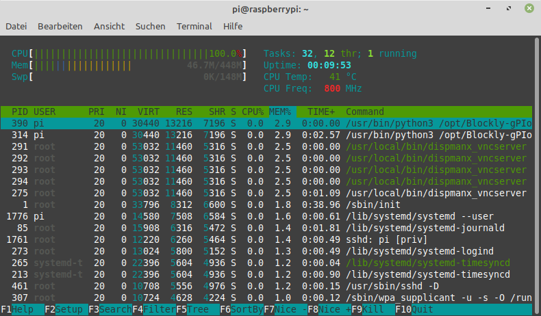
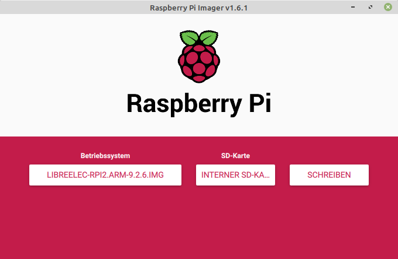
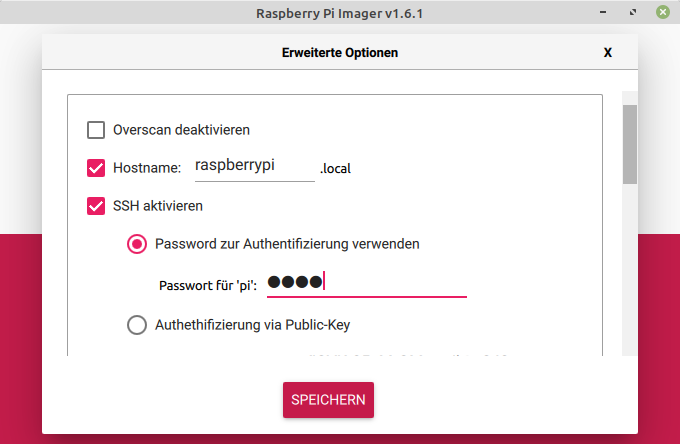
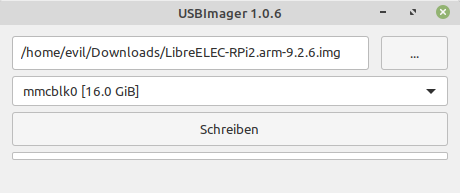
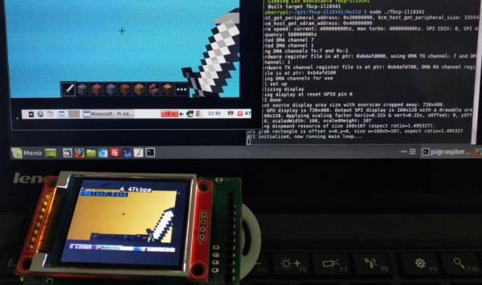
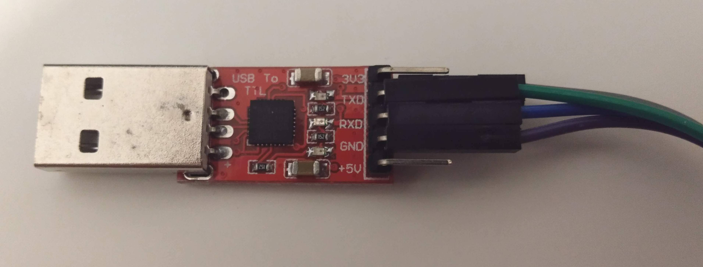

+++
author = "Martin Strohmayer"
title = "Raspberry Pi Werkzeuge"
date = "2021-04-14"
description = ""
featured = true
tags = [
    "Raspberry Pi", "Tools"
]
categories = [
    "Raspberry Pi"
]
image = "images/Tools.jpg"
thumbnail = "images/Tools.jpg"
+++

Der Raspberry Pi ist eine ganz spezielle Computerhardware, so gibt es auch Werkzeuge die speziell für den Raspberry Pi gemacht oder angepasst wurden. Die folgende Liste stellt einige von ihnen vor.  
<!--more-->

## Beschreibung

Auch wenn es inzwischen viele verschiedene Einplatinencomputer gibt, so ist der Raspberry Pi doch sehr speziell. Der SoC und die enthaltene Grafikkarte ist kaum wo anders in Einsatz.
Daher gibt es speziell an die Raspberry Pi und der GPU angepasste Werkzeuge. Die folgende List ist sicher nicht komplett aber einige Werkzeuge sind mir unter gekommen, die ich besonders gerne einsetze.

## Software

### Screenshot - raspi2png

Mit [raspi2png](https://github.com/GrazerComputerClub/raspi2png) kann man Screenshots im PNG-Format erzeugen. Das besondere daran ist, dass es direkt mit der GPU der Raspberry Pi zusammenarbeitet.
Dadurch kann es auch Screenshots erzeugen wo andere Programme wie z.B. [scrot](https://wiki.ubuntuusers.de/Scrot/) nicht funktionieren. Das ist bei allen Programm der Fall die direkt in der GPU arbeiten. Videos abspielen und Minecraft Pi sind solche Anwendungen bei denen nur raspi2png funktioniert.  
Das Programm war nicht optimal für den Einsatz mit einem Hotkey ausgelegt und so habe ich es kurzerhand erweitert und optimiert. Darum empfehle ich auch den Fork der auf der Git-Hub Seite des Grazer Computer Clubs liegt. Das originale Projekt ist auf https://github.com/AndrewFromMelbourne/raspi2png verfügbar.

### VNC Server - dispmanx_vnc

[dispmanx_vnc](https://github.com/patrikolausson/dispmanx_vnc) ist eine [VNC Server](https://de.wikipedia.org/wiki/Virtual_Network_Computing) mit dem man die grafische Oberfläche auf einen VNC-Client übertragen kann. Es gibt natürlich andere VNC Server, die allerings unter X11 laufen. dispmanx_vnc stellt direkt den Inhalt der GPU zur Verfügung. Das hat zum einen den Vorteil der guten Performance aber der Hauptgrund warum das Tool so besonders ist, ist das es in jeder Situation funktioniert. Ob man sich in der Konsole oder in X11 befindet ist egal, ob eine Video abgespielt wird oder Minecraft Pi gespielt wird - egal - die Übertragung per VNC funktioniert. Sogar eine Kodi Oberflache kann übertragen werden.  
Allerdings hat das Programm auch Nachteile. Das Projekt wurde von https://github.com/hanzelpeter/dispmanx_vnc geforkt und verbessert. Allerdings wurde die Lizenz entfernt was nun dazu führt, dass es eigentlich nicht mehr unter einen freien Lizenz verfügbar ist. Das originale Projekt kann man aber nicht empfehlen. Weiters wurden die Umsetzung der Tastencodes wenn der VNC-Client eingaben tätig, fix kodiert. Das bewirkt, dass immer ein amerikanisches Tastaturlayout verwendet wird und dieses noch zusätzlich nicht komplett umgesetzt wurde.
Aufgrund des Lizenzproblem kann ich auch das Problem nicht beheben.  
Dennoch für die Weiterleitung der grafische Oberfäche ist es aufgrund der Performance und universellen Einsetzbarkeit der VNC Server den ich empfehlen würde. Auf dem Blog des Grazer Computer Clubs gibt es einen Beitrag [VNC - Virtual Network Computing](https://blog.gc2.at/post/vnc/) speziell zu dem Programm.  

### Hotkey - triggerhappy

[triggerhappy](http://manpages.ubuntu.com/manpages/precise/man1/thd.1.html) ist nichts Raspberry Pi spezifisches, es ist aber auf Raspberry Pi OS vorinstalliert. Das Programm ermöglicht es Tastatur-Hotkeys zu definieren ohne das X11 oder ähnliches läuft. Damit kann man z. B. Multimedia-Tasten wie Lauter und Leiser auch auf einem Raspberry Pi zum Funktionieren bringen. 
Auch hierzu gibt es auf dem Blog des Grazer Computer Clubs den Beitrag [Hotkeys zuweisen ohne X11](https://blog.gc2.at/post/hotkeys-zuweisen-ohne-x11/) speziell zu dem Programm. 

### System Monitor/Prozessmanager - htop

htop ist eine altbekanntes Diagnose Program bzw. Prozessmanager. In letzter Zeit ist nun wieder dynamik in die Entwicklung gekommen, nachdem lange Zeit nicht passiert ist. Das Projekt ist nun auf https://github.com/htop-dev/htop verfügbar und mitlerweile auf Version 3. Es kursieren aber noch einige Forks. Besonders die Armbian Version sticht durch zusätzlich Features für ARM Prozessoren heraus. Es ist nun möglich die aktuelle CPU-Frequenz und CPU-Temperatur im Kopf anzeigen zu lassen. Vor vielen Jahren wurde bereits so eine Version für den Raspberry Pi vorgestellt. Auf https://github.com/hishamhm/htop ist sie zu finden. Sie basiert allerdings auf einer alten htop Version 2 von 2018. Sie gilt aktuell also nur noch als Archiv.  
Ausgehend von dieser Version haben ich auch einige Änderungen eingebraucht, die vorallem die Farben für die Anzeige der CPU-Temperatur und CPU-Frequenz anpassen soll. Inwieweit diese Änderungen auch in einer Version 3 enthalten sind, bzw. übernehmbar wären, ist mir nicht bekannt. Aktuell wird bei Raspberry Pi OS aber die alte Version 2 eingesetzt und so kann ein Update auf die Version vom Grazer Computer Club einen Mehrwert bringen. Sie ist unter https://github.com/GrazerComputerClub/htop verfügbar. Im übrigen kann man die neuen Anzeigen mit der Taste F2 hinzufügen!

 

### SD Karten Schreiben - Raspberry Pi Imager und USB Imager

Lange Zeit hatte es keine sinnvolles Werkzeug zum Beschreiben einer SD-Karte unter Linux gegeben. Das Programm wird benötigt um ein Raspberry Pi Image bzw. Betriebssystem Image auf die SD-Karte zu bringen. Anfänglich musste man dd verwenden, das für Anfänger einfach zu viele Gefahren birgt. Danach kamm das Programm etcher, dass den Vorgang wesentlich sicherer und einfacher machte. Das Programm selbst ist aber etwas zwielichtig. Es ist riesig und muss als eigenständiges Programm heruntergeladen und ausgeführt werden.  
Nun gibt es endlich das Programm Raspberry Pi Imager und USB Imager, dass diesen Dienst verrichtet und nur minimale Anforderungen stellt. Ich würde Raspberry Pi Imager empfehlen. Es bietet zusätzlich die Möglichkeit weitere Einstellungen für das Betriebssystem vorzunehmen. Dazu gehört z.B. die Aktivierung des SSH-Dienstes, inklusive einem Passwort für den Benutzer Pi. Dann können die Ländereinstellungen inkl. Tastaturlayout definiert werden. Auch ein WLAN Netzwerk kann für den ersten Start bereits parametriert werden. Zum Einstellungsfenster kommt man allerdings erst wenn man Strg+Shift+X drückt!  
Das Programm unterstützt auch komprimierte Images mit der Extention gz, zip und xz.  
Zur Installation kann man einfach das deb-Packet herunterladen und mit ``sudo apt install ./imager_1.6.1_amd64.deb`` installieren.

  
Raspberry Pi Imager - https://www.raspberrypi.org/software/  

USB Imager - https://gitlab.com/bztsrc/usbimager  

### SPI LCD-TFT Anzeige - fbcp-ili9341

Bei Kernel 4 konnte man noch einen SPI LCD-TFT Display über ein Kernel Modul ansprechen. Leider ist das mit Kernel 5 nun nicht mehr möglich. Zum Glück gibt es aber ein Programm mit dem verwirrenden Namen [fbcp-ili9341](https://github.com/juj/fbcp-ili9341). fbcp steht dabei für Framebuffer copy und ili9341 für den gleichnamigen SPI Display Controller. Das Programm kann also den Inhalt der Grafikkarte (Framebuffer) über den SPI-Bus auf das LCD-TFT Display übertragen. Das ganze läuft nun etwas langsamer als früher im Userspace, kann aber überzeugen.  
Auch hierzu gibt es auf dem Blog des Grazer Computer Clubs den Beitrag [SPI TFT LCD - Kernel 5](https://blog.gc2.at/post/spi-tft-lcd-kernel5/). Im übrigen Unterstützt das Programm auch andere SPI-Controller wie ST7735R und ST7789VW.

### (Serieller) Terminal Client - screen

screen ist eigentlich ein Programm das mehrere Terminals verwalten kann. Es ist kein reines Werkzeug für den Raspberry Pi sondern ist praktisch auf allen Linux Systemen verfügbar.  
Nicht so bekannt ist allerdings die Möglichkeit screen auch für serielle Terminals zu verwenden. Dazu muss man einfach die serielle Schnittstelle bzw. das Linux-Device als Parameter angeben. Beim Raspberry Pi ist das typischerweise ``/dev/ttyAMA0`` (sofern die serielle Schnittstelle aktiviert ist) und  ``/dev/ttyUSB0`` bei einem USB-Adapter.
Optional kann man auch die Baudrate für die Verbindung mit angeben.

``screen /dev/ttyAMA0 115200``

Benötigt wird dies z.B. wenn man sich per serielle Schnittstelle auf einen Raspberry Pi Zero V1.3 verbinden möchte. Ihm fehlt es ja an einer LAN und WLAN Kommunikationsmöglichkeit.  
Aber Achtung dieser Terminal ist nicht exakt gleich wie ein ssh-Terminal. Es werden z.B. keine Farben unterstützt.

## Hardware

### Serieller/UART USB-Adapter

Wie man beim Software Werkzeug screen gesehen hat, ist eine serielle Verbindung zu manchen Geräten wie einem Raspberry Pi Zero V1.3 oder einem Microkontroller (z.B. ESP-01 oder Blue Pill) ganz nützlich.  
Daher würde ich jeder Bastlerin und jedem Bastler empfehlen einen USB-TTL-Seriell Adapter bzw. "USB to TTL serial cable" in die Werkzeugkiste zu geben. Beispielweise einer mit dem Chipsatz CP2102. Optimalerweise arbeitet der USB-Adapter mit 3,3 V Signalspannung und kann direkt 3,3 V und 5 V Betriebsspannug bereitstellen. Wenn er dann auf Linux und Windows direkt unterstützt wird, ist alles perfekt.

