+++
author = "Martin Strohmayer"
title = "WLED LED-Streifen mit ESP8266"
date = "2023-12-08"
description = ""
featured = true
tags = [
    "Mikrocontroller",
    "ESP8266"
]
categories = [
    "Elektronik"
]
image = "images/WLED.png"
thumbnail = "images/WLED.png"
+++

Einen über WLAN konfigurier und steuerbaren LED-Streifen ist denkbar einfach zu realisieren.  
<!--more-->

## Beschreibung

Einen über WLAN konfigurier- und steuerbaren LED-Streifen ist denkbar einfach zu realisieren. Die Harware ist kostengünstig, die Verkabelung und Installation einfach, die Parametrierbarkeit enorm.
 Man muss lediglich folgende Komponetnen haben

 - LED Streifen mit WS2812 Chip (3-Polig), beliebig lang z. B. 30 LEDs
 - ESP 8266 Board mit USB Anschluss (z.B. D1 Mini ESP8266)
 - USB-Kabel und 5V Netzteil oder USB-Ausgang

Man könnte es auch mit einem ESP-01 Board realisieren, aber dann muss man sich um die 5 V und 3,3 V Anschluss und Versorgung kümmern. Einfacher ist es gleich ein kostengünstiges D1 Mini Board zu verwenden. Es kann über einen Micro-USB-Anschluss programmiert und versorgt werden. Allerdings sollte man dann nicht zu viele LED ansteuern bzw. die Stromaufnahme mit der WLED Konfiguration  reduzieren (es wird empfohlen unter 1 A zu bleiben). Ansonsten müsste man ein eigenes Netzteil bzw. Versorgung für den LED-Streifen vorsehen.
Wir werden hier die einfacher Lösung, mit  der Versorgung über das ESP-Board verwenden und die LED-Leistung in WLED optimieren.


## Anschluss

ESP | LED-Stripe 
--- | -------- 
5V  | +5V (Plus)
G   | - (Minus)
D4  | Di (Data)

D4 ist beim ESP GPIO2.  

## Installation WLED

### USB Port Check

Bevor es nun zur Installation geht muss man überprüfen ob das ESP-Board am Linux System erkannt wird.

ESP serielle Schnittstelle überprüfen:

```
dmesg | tail -n 10
```

```
[ 1972.709131] usb 2-2: New USB device found, idVendor=1a86, idProduct=7523, bcdDevice= 2.54
[ 1972.709146] usb 2-2: New USB device strings: Mfr=0, Product=2, SerialNumber=0
[ 1972.709152] usb 2-2: Product: USB2.0-Ser!
[ 1972.710859] ch341 2-2:1.0: ch341-uart converter detected
[ 1972.711342] ch341-uart ttyUSB0: break control not supported, using simulated break
[ 1972.711995] usb 2-2: ch341-uart converter now attached to ttyUSB0
[ 1973.267032] input: BRLTTY 6.4 Linux Screen Driver Keyboard as /devices/virtual/input/input40
[ 1973.385261] usb 2-2: usbfs: interface 0 claimed by ch341 while 'brltty' sets config #1
[ 1973.385623] ch341-uart ttyUSB0: ch341-uart converter now disconnected from ttyUSB0
[ 1973.385643] ch341 2-2:1.0: device disconnected
```

Der USB-Port des ESP sollte also ttyUSB0 sein. Aber da gibt es einen Fehler mit BRLTTY.
BRLTTY ist "Braille Device Support" also ein Dienst für Blinde Menschen. Wir also zumeist nicht benötigt werden.
Wir deaktivieren den Dienst der die nutzung des ttyUSB0 Ports verhindert.

```
sudo systemctl stop brltty
sudo systemctl disable brltty
sudo systemctl stop brltty-udev
sudo systemctl mask brltty-udev
```
Nun kann man nochmal ab und anstecken.

```
dmesg | tail -n 10
```

```
[ 3542.820230] usb 2-2: new full-speed USB device number 16 using xhci_hcd
[ 3542.969251] usb 2-2: New USB device found, idVendor=1a86, idProduct=7523, bcdDevice= 2.54
[ 3542.969266] usb 2-2: New USB device strings: Mfr=0, Product=2, SerialNumber=0
[ 3542.969272] usb 2-2: Product: USB2.0-Ser!
[ 3542.971132] ch341 2-2:1.0: ch341-uart converter detected
[ 3542.971613] ch341-uart ttyUSB0: break control not supported, using simulated break
[ 3542.971756] usb 2-2: ch341-uart converter now attached to ttyUSB0
```


### Web-Installation

Die Installaltion erfolggt super einfach mit Chromium Browser über Web-Seite https://install.wled.me/
Zuerst wählt man die aktuelle Version z. B. 0.14.0 und nach dem Drücken auf die Schaltfläche "Install" geht es los. 
Zuerst muss man den richtige USB Port auswählen, also in userem Fall ttyUSB0.

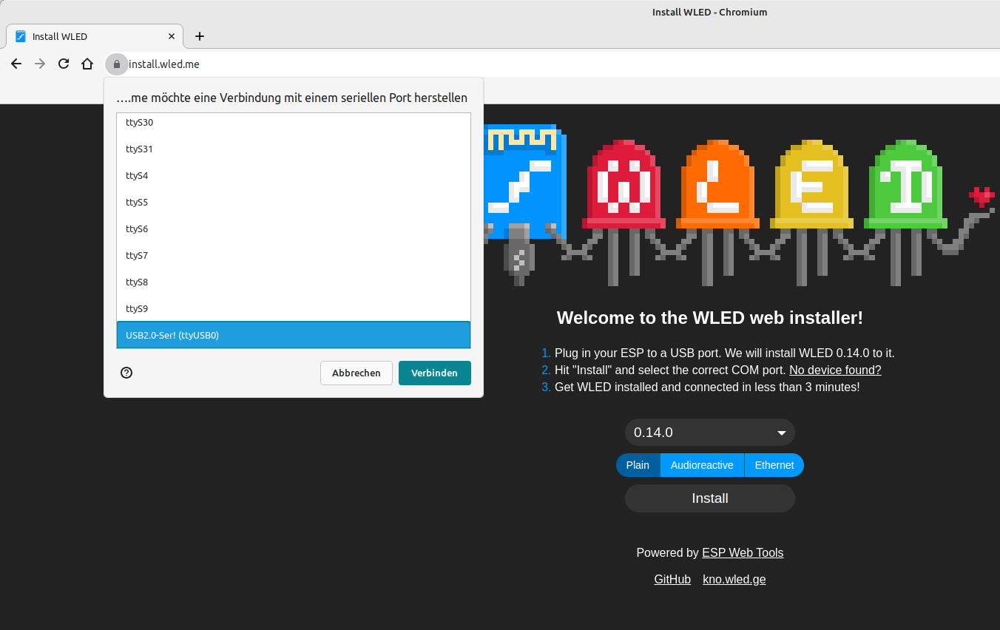

Dann klick man sich durch die folgenden Fenster.

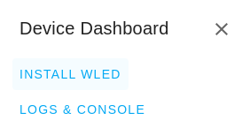
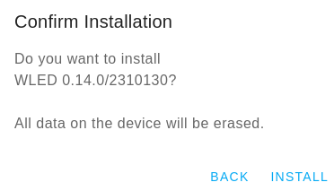
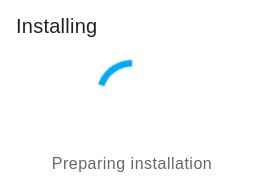
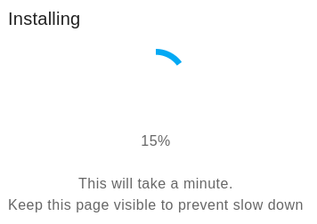
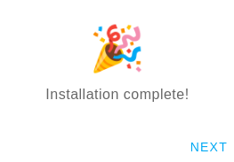

Dann kann man gleich das eigene WLAN Netzwerk parametrieren in das sich der ESP anmelden soll.

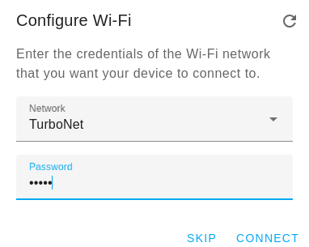
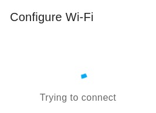

Nach dem Speichern muss man sich wieder in seinem Netzwerk anmelden und das Gerät (über Router oder Fing App) suchen bzw. die IP-Adresse herausfinden.


### Manuelle Installation


Anschluss ESP-01 über USB-Adapter und  GPIO2 muss auf Ground gelegt werden (damit man den ESP programmieren kann). 

```
sudo apt-get install python3 python3-pip
sudo pip3 install esptool nodemcu-uploader
```
```
sptool.py -p /dev/ttyUSB0 chip_id
```
```
esptool.py v4.6.2
Serial port /dev/ttyUSB0
Connecting...
Detecting chip type... Unsupported detection protocol, switching and trying again...
Connecting...
Detecting chip type... ESP8266
Chip is ESP8266EX
Features: WiFi
Crystal is 26MHz
MAC: 6c:df:7f:20:d4:a8
Stub is already running. No upload is necessary.
Chip ID: 0x0010d458
Hard resetting via RTS pin...
```

Download ESP-01 binary Datei von https://github.com/Aircoookie/WLED/releases

```
wget https://github.com/Aircoookie/WLED/releases/download/v0.14.0/WLED_0.14.0_ESP01.bin
esptool.py -p /dev/ttyUSB0 write_flash 0x0 ./WLED_0.14.0_ESP01.bin
```

```
esptool.py v4.6.2
Serial port /dev/ttyUSB0
Connecting...
Detecting chip type... Unsupported detection protocol, switching and trying again...
Connecting...
Detecting chip type... ESP8266
Chip is ESP8266EX
Features: WiFi
Crystal is 26MHz
MAC: 6c:df:7f:20:d4:a8
Stub is already running. No upload is necessary.
Configuring flash size...
Flash will be erased from 0x00000000 to 0x000d0fff...
Compressed 854000 bytes to 619031...
Wrote 854000 bytes (619031 compressed) at 0x00000000 in 54.8 seconds (effective 124.8 kbit/s)...
Hash of data verified.

Leaving...
Hard resetting via RTS pin...
```

ESP-01 abstecken und entfernen der Ground Verbindung von GPIO2 sowie RXD und TXD.

Nun kann man den WLAN AccessPoint WLED-AP finden. Bei der Verbindung muss man das Password **wled1234** eingeben.


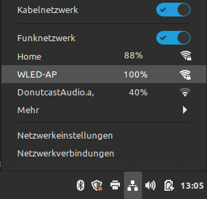


Das Web-Interface ist nun unter http://4.3.2.1/ errreichbar.
Nun kann man sein eigenes WLAN-Netzwerk einrichten damit sich der ESP damit verbinden kann.

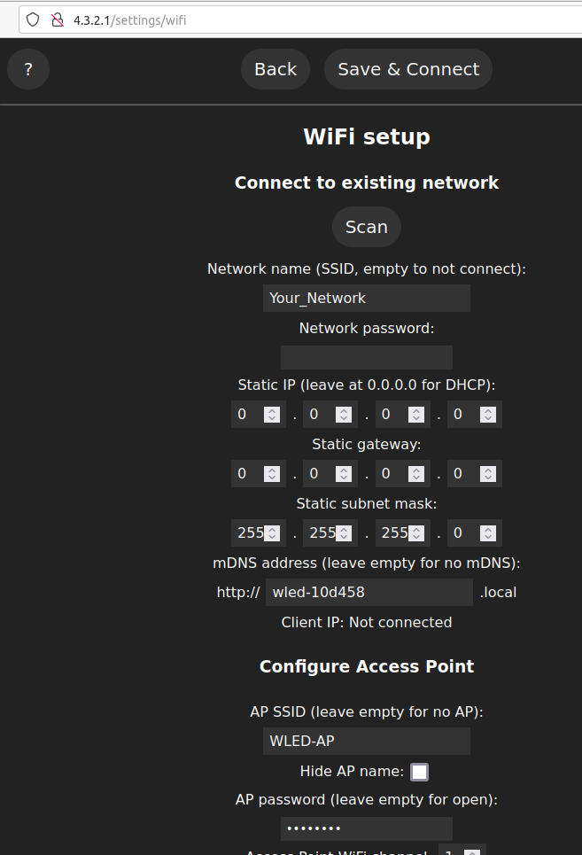


Nach dem Speichern muss man sich wieder in seinem Netzwerk anmelden und das Gerät (über Router oder Fing App) suchen bzw. die IP-Adresse herausfinden.


## WLED Konfiguration

Auf der ersten Seite kann man sich verschiedene Presets anlegen (ID und Name) und die gewünschten Effekte, Farben und Muster auswählen.
Man kann sich hier auch einen "Ausgeschaltet" Preset anlegen, ich verwende dazu ID 99.
Unter der Schatfläche Config können wir verschiedene Einstellungen vornehmen.

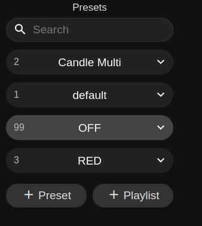

### Uhrzeit und Zeitsteuerung

Unter "Config"/"Time & Macros" können wir einen neuen NTP-Server eingeben, z. B. 0.at.pool.ntp.org.
Wichtiger ist allerdings die Zeitzone für Zentral-Europa also CET/CEST zu setzen, dann sollte die angezeigte Zeit bereits stimmen.  
Weiter unten kann man dann auch zeitgesteuert den Streifen ein- und ausschalten bzw auch verschiedene Presets laden.

### LED Strom begrenzen

Da wir keine Leistungfähiges gesondertes Netzteil einsetzen sollte man den Strom der LEDs begrenzen.
Das kann ünter "Config"/"LED Preferences" gemacht werden.

Enable automatic brightness limiter: Ja  
Maximum Current: 650 mA  
LED voltage (Max. current for a single LED): 5V (efficient (35mA)  

Mit der Schaltfläche Save ganz oben oder ganz unten kann man die Einstellungen sichern.  

### Backup

Hat man alles eingerichtet kann man sich die Presets und Konfigurationen unter  "Config"/"Security & Update" mit der Schaltfläche "Backup presets" und "Backup configuration" lokal speichern. Mit den entsprechenden "Upload" Schlatflächen können sie wieder eingespielt werden.